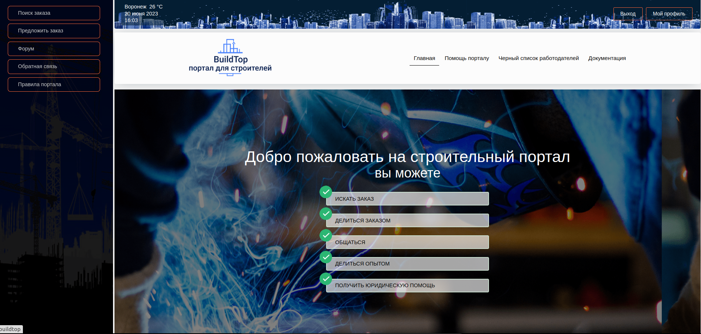
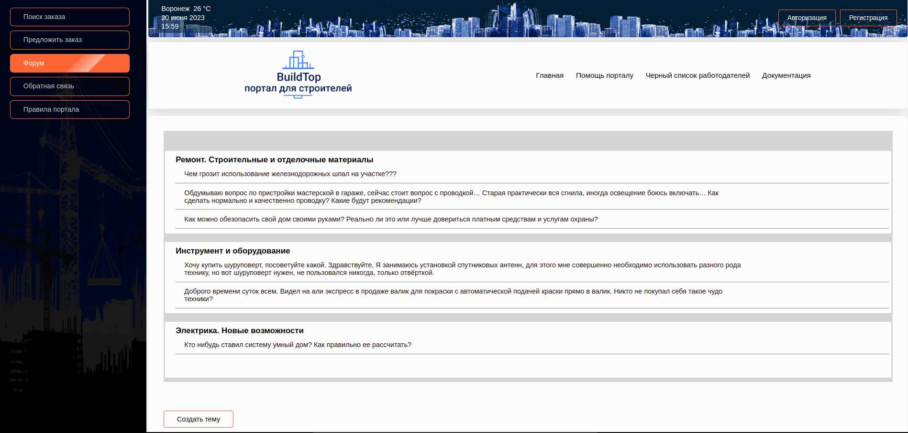
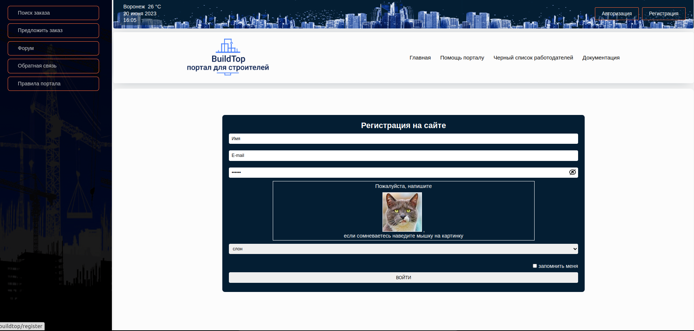

# BuildTop - this is an information portal for builders

This project was developed by me for practice php.

## applied technologies

* PHP
* SQL
* JS
* HTML
* CSS

## a little bit about this project

### With this portal, the user can search for an order, share an order and chat on the forum:

### implemented such functionality as:

* registration
* authorization
* password recovery
* feedback

To use it, you need to clone this repository:

- git clone https://github.com/VictoriaBabikova/BuildTop.git

to install all packages, you need to run:

- composer install
